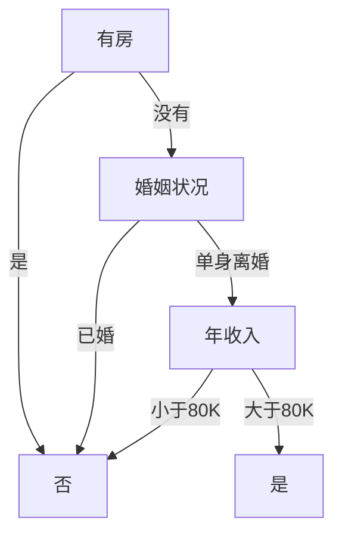
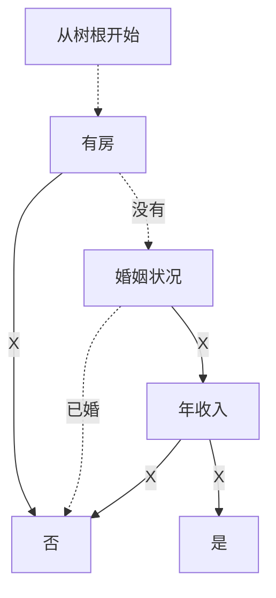
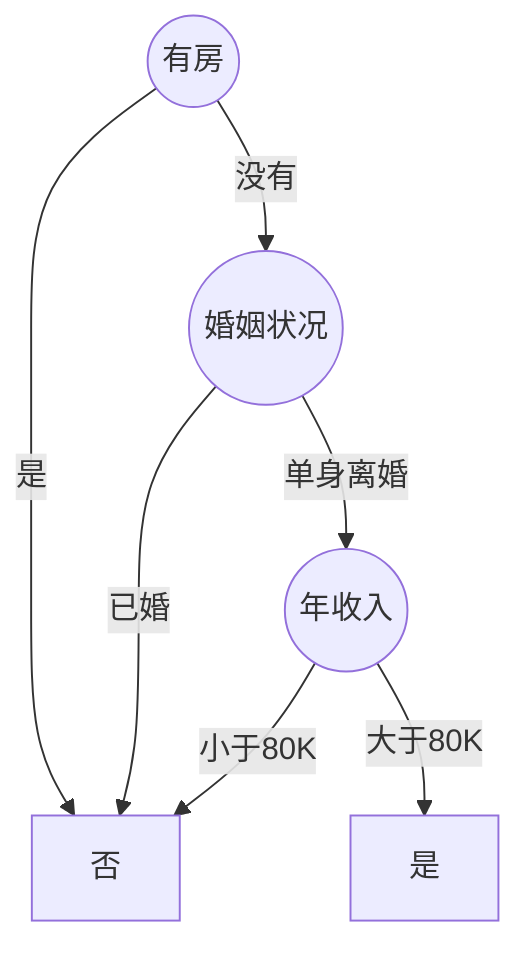
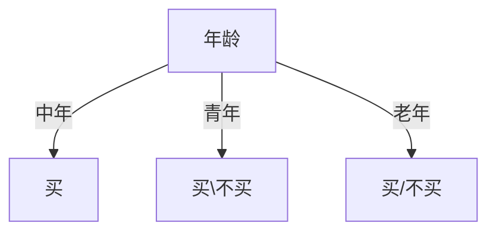
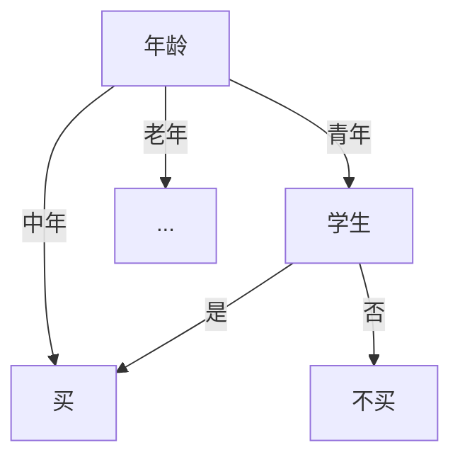
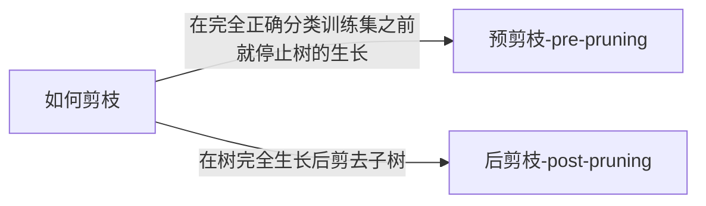
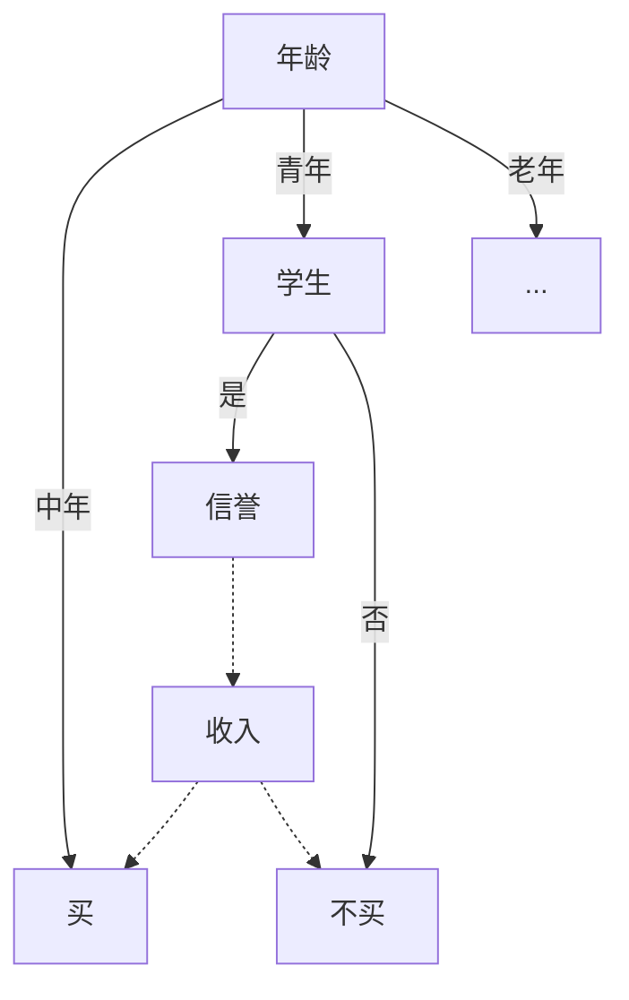

# 决策树
作者: 李峥
E-mail : hughli@live.com

--------------
- 目录：
- 决策树
- 1. 决策树概览
- 1.1 决策树的应用
- 训练数据：
- 1.3 分类原理
- 新数据：
- 输出结果：
- 决策树建立基本原理
- 2. 决策树历史
- 3. 决策树算法
- 3.1 ID3算法
- 3.1.1 基本概念
- 3.1.2 如何选择属性
- 3.1.3 信息增益
- 3.1.4 ID3算法思想
- 3.1.5 例子
- 3.1.5.1 数据处理：
- 3.1.5.1 计算训练样本集的熵：
- 3.1.5.3 计算各属性对S进行划分获得的信息增益
- 3.1.5.4 计算选择节点
- 3.1.6 ID3算法的优缺点
- 3.2 C4.5算法
- 3.2.1 C4.5的提出
- 3.2.2 C4.5与ID3的不同点
- 3.2.3 C4.5的增益比例
- 3.2.4 例子
- 3.2.5 C4.5缺失数据的处理
- 3.2.6 K倍交叉验证：选树、剪枝
- 3.2.6.1 预剪枝
- 3.2.6.2 后剪枝

## 1\. 决策树概览

### 1.1 决策树的应用

- 商业领域：客户关系管理、数据库营销、客户群体划分、交叉销售等市场分析行为，以及客户流失分析、客户信用计分及欺诈发现等。
- 工业领域：故障诊断、工业生产过程控制等。
- 医学领域：疾病诊断治疗、基因与高分子序列分析、医院信息系统挖掘及医疗政策分析等。
- 应用系统：LMDT、OCI、SE-Learn、SIPINA-W、AC2、C4.5、IND 、KATE-Tools、Knowledge SEEKER、SPSS CHAID、CART等。另外 ，还有美国Vanguard Software公司的Decision Pro3.0，Litigation Risk Analysis公司的Litigation Risk Analysis。SAS和SGI等公司的数据挖掘系统中都有决策树模块

  ### 1.2建立模型

#### 训练数据：

Tid | 有房者 | 婚姻状况 | 年收入  | 拖欠贷款
:-: | :-: | :--: | :--: | :--:
 1  |  是  |  单身  | 125K |  否
 2  |  否  |  已婚  | 100K |  否
 3  |  否  |  单身  | 70K  |  否
 4  |  是  |  已婚  | 120K |  否
 5  |  否  |  离异  | 95K  |  是
 6  |  否  |  已婚  | 60K  |  否
 7  |  是  |  离异  | 220K |  否
 8  |  否  |  单身  | 85K  |  是
 9  |  否  |  已婚  | 75K  |  否
10  |  否  |  单身  | 90K  |  是

### 1.3 分类原理

#### 新数据：

Tid | 有房者 | 婚姻状况 | 年收入  | 拖欠贷款
:-: | :-: | :--: | :--: | :--:
 1  |  是  |  单身  | 125K |  ？

#### 输出结果：

Tid | 有房者 | 婚姻状况 | 年收入  | 拖欠贷款
:-: | :-: | :--: | :--: | :--:
 1  |  是  |  单身  | 125K |  否

### 决策树建立基本原理

1. 基本算法（贪心算法）
2. 自上而下分而治之的方法
3. 开始时，所有的数据都在根节点
4. 属性都是离散值字段 (如果是连续的，将其离散化)
5. 所有记录用所选属性递归的进行分割
6. 停止分割的条件
7. 一个节点上的数据都是属于同一个类别
8. 没有属性可以再用于对数据进行分割

### 2\. 决策树历史

- CLS：决策树方法最早产生于20世纪60年代，是由Hunt等人研究人类概念 建模时建立的学习系统CLS（Concept Learning System）。
- ID3：1979年, J.R. Quinlan 给出ID3算法，并在1983年和1986年对ID3进行 了总结和简化，使其成为决策树学习算法的典型。
- CHAID和CART：1975年和1984年分别提出。CART的决策树由二元逻辑 问题生成，每个树节点只有两个分枝，分别包括学习实例的正例与反例。
- ID4：Schlimmer 和Fisher 于1986年对ID3进行改造，在每个可能的决策树 节点创建缓冲区，使决策树可以递增式生成，得到ID4算法。
- ID5：1988年，Utgoff 在ID4基础上提出了ID5算法，进一步提高了效率。
- C4.5：1993年，Quinlan本人以ID3算法为基础研究出算法。新算法在对预 测变量的缺失值处理、剪枝技术、派生规则等方面作了较大改进
- C5.0：C4.5的商业改进版。

### 3\. 决策树算法

Tid | 有房者 | 婚姻状况 | 年收入  | 拖欠贷款
:-: | :-: | :--: | :--: | :--:
 1  |  是  |  单身  | 125K |  否
 2  |  否  |  已婚  | 100K |  否
 3  |  否  |  单身  | 70K  |  否
 4  |  是  |  已婚  | 120K |  否
 5  |  否  |  离异  | 95K  |  是
 6  |  否  |  已婚  | 60K  |  否
 7  |  是  |  离异  | 220K |  否
 8  |  否  |  单身  | 85K  |  是
 9  |  否  |  已婚  | 75K  |  否
10  |  否  |  单身  | 90K  |  是

- 回到开始的数据,在实际情况中，数据不会这么理想也不仅仅有这几个字段，实际情况可能下表的样子；

Tid | 有房者 | 婚姻状况 | 年收入  | 年龄 | 性别 | 是否为公务员 | 拖欠贷款
:-: | :-: | :--: | :--: | :-: | :-: | :----: | :--:
 1  |  是  |  单身  | 125K | 20 | 女  |   是    |  否
 2  |  否  |  已婚  | 100K | 28 | 男  |   否    |  否
 3  |  否  |  单身  | 70K  | 33 | 男  |   否    |  否
 4  |  是  |  已婚  | 120K | 50 | 女  |   否    |  否
 5  |  否  |  离异  | 95K  | 26 | 女  |   是    |  是
 6  |  否  |  已婚  | 60K  | 22 | 女  |   否    |  否
 7  |  是  |  离异  | 220K | 50 | 男  |   否    |  否
 8  |  否  |  单身  | 85K  | 30 | 男  |   是    |  是
 9  |  否  |  已婚  | 75K  | 26 | 男  |   是    |  否
10  |  否  |  单身  | 90K  | 22 | 女  |   是    |  是

- 这个时候我们是不知道应该用哪些数据去构建这颗树。

- 引入概念： 属性选择度量 属性选择度量又称分裂规则，根据该准则分裂后的输出将样本集细化，理性情况下，每个划分是"纯"的。 （纯，即划分后各组中所有样本都属于相同的类）

- 目前经典的决策树算法主要采用信息增益，增益比例，Gini指标来选择度量属性。

#### 3.1 ID3算法
##### 3.1.1 基本概念

  ID3算法主要针对属性选择问题。是决策树学习方法中最具影响和最为典型的算法。该方法使用信息增益选择测试属性。

- 分类划分的优劣用不纯性度量来分析。如果对于所有分支，划分后选择相同分支的所有实例都属于相同的类，则这个划分是纯的。

- 纯和不纯如下

 字段   | 数量
:---: | :----:
拖欠贷款  | 5
没拖欠贷款 | 5

不纯，两种类型的都有，最高的不纯度

 字段   | 数量
:---: | :----:
拖欠贷款  | 10
没拖欠贷款 | 0

纯，全都是同一类，不纯度为0

- 熵的定义 设S是训练样本集，它包含n个类别的样本，这些类别分别用C1，C2，...，Cn表示，那么S的熵（entropy）或者期望信息为：
\[
 entropy(S) = -\sum_i^n P_i log_{(2)} p_i
\]

- 其中，pi表示类Ci的概率。如果将S中的n类训练样本看成n种不同的消息，那么S的熵表示对每一种消息编码平均需要的比特数，度量了系统的平均信息量。|S|*entropy(S)就表示对S进行编码需要的比特数，其中，|S|表示S中的样本数目。

- 例：假设有一个数据集合D，其中只有两个类，一个是正类，一个是负类。计算D中正类样本和负类样本在三种不同的组分下熵的变化情况。

- （1）D中包含有50%的正类样本和50%的负类样本。

\[
    Entropy(D)=-0.5\times log_2 0.5-0.5\times log_2 0.5=1
\]

- （2）D中包含有20%的正类样本和80%的负类样本。
 \[
  Entropy(D)=-0.2\times log_2 0.2-0.8\times log_2 0.8=0.722
  \]
- （3）D中包含有100%的正类样本和0%的负类样本。 [

  \[
    Entropy(D)=-1\times log_2 1-0\times log_2 0=0
  \]

  ]

- 熵可以作为数据纯净度或混乱度的衡量指标。熵越小，数据越纯

--------------------------------------------------------------------------------

##### 3.1.2 如何选择属性
如下图所示如何选出这些圆节点？在前面所提到得表中有很多属性，包括：有房者，婚姻状况，年收入，年龄，性别，是否为公务员；那选哪些属性来判断这个人是否拖欠贷款呢？

#### 3.1.3 信息增益

设属性A将S划分成m份，根据A划分的子集的熵或期望信息为：

\[
entropy(S,A) = \sum_i^n \frac{|S_i|}{|S|} entropy(S_i)
\]

- **entropy(S,A) 越小，划分的纯度越高**
- **信息增益用来衡量熵的期望减少值，因此，使用属性A对S进行划分获得的信息增益为**
 \[
  gain(S,A)=entropy(S)-entropy(S,A)
 \]
- **对于特征A，信息增益的计算方法是分割前的数据分区（S）的熵值减去由分割产生的数据分区（S1）的熵值**
- **gain(S,A)越大，说明选择测试属性对分类提供的信息越多**
 \[
   max_A gain(S,A)
 \]

#### 3.1.4 ID3算法思想

- ID3算法是通过选择具有最高信息增益的属性作为数据 集的划分，从而可创建决策树中的一个节点，根据该 属性的不同取值可形成该节点的不同分枝。
- 再对各分枝中的数据子集进行递归划分，直至(1)或(2)

  - (1) 形成叶节点,即该节点的所有样本均属于同一类
  - (2)某分枝上的所有数据不属于同一类别，但又没有剩余的属性可以进一步划分为止

- 原始数据：

姓名 | 年龄 |  收入  | 学生 | 信誉 |    电话   |  地址  |   邮编 |    买计算机
:-: | :-: | :-: | :-: | :-: | :--------: | :--: | :---------: | :--------:
张三 | 23 | 4000 | 是  | 良  | 281-322-0328 | 2714 Ave. M    |   77388| 买
王二 | 70 | 1900 | 否  | 优  | 281-242-3222 | 2000 Bell Blvd.  |  70244| 不买
李四 | 34 | 2800 | 否  | 优  | 713-239-7830 | 5606 Holly Cr   |   78766| 买
赵五 | 18 | 900  | 是  | 良  | 281-550-0544 | 100 Main Street |   70244 |买
刘兰 | 34 | 2500 | 否  | 优  | 713-239-7430 | 606 Holly Ct   |   78566| 买
杨俊 | 27 | 8900 | 否  | 优  | 281-355-7990 | 233 Rice Blvd. | 70388 |不买
张毅 | 38 | 9500 | 否 | 优 | 281-556-0544 | 399 Sugar Rd. | 78244 |买
.......|
#### 3.1.5 例子
##### 3.1.5.1 数据处理：
  - 数据清洗
  - 数据标准化
  - 数据归纳
  - 删除无关属性

处理后：

计数| 年 龄|收 入|学 生|信誉 |归类： 买计算机？
----|-----|-----|------|----|------
64 |青| 高| 否| 良| 不买
64| 青| 高| 否| 优 |不买
128 |中| 高| 否 |良| 买
60 |老| 中| 否| 良 |买
64 |老| 低| 是| 良 |买
64| 老 |低| 是 |优| 不买
64 |中| 低| 是| 优 |买
128| 青| 中| 否 |良 |不买
64| 青| 低 |是 |良| 买
132| 老|中 |是| 良| 买
64 |青| 中| 是| 优| 买
32 |中 |中 |否| 优| 买
32 |中| 高| 是| 良| 买
63 |老 |中| 否| 优| 不买
1  |老 |中 |否 |优 |买

##### 3.1.5.1 计算训练样本集的熵：

\[
 entropy(S) = -\sum_i^n P_i log_{(2)} p_i
\]

- 决策属性“买计算机？”。该属性分两类：买/不买
- 买：641
- 不买：383
- S：买 + 不买 = 1024
- 分别计算买的和不买的所占比例
\[
P_1 = 641 \div 1024 = 0.6260
\]
\[
P_2=383/div 1024=0.3740
\]

\[
entropy(S) =-P_1\times log_2P_1-P_2*log_2P2 = 0.9537
\]

##### 3.1.5.3 计算各属性对S进行划分获得的信息增益
- 条件属性共有4个。分别是年龄、 收入、学生、信誉。分别计算不同属性的信息增益。
- **公式回顾**：
 \[
 entropy(S) = -\sum_i^n P_i log_{(2)} p_i
 \]

 \[
 entropy(S,A) = \sum_i^n \frac{|S_i|}{|S|} entropy(S_i)
 \]
 - **entropy(S,A) 越小，划分的纯度越高**
 - **信息增益用来衡量熵的期望减少值，因此，使用属性A对S进行划分获得的信息增益为**
 \[
gain(S,A)=entropy(S)-entropy(S,A)
 \]
 - **gain(S,A)越大，说明选择测试属性对分类提供的信息越多**
**********************
- 计算各属性划分的子集的熵
- 年龄共分三个组：
- 青年、中年、老年
- 青年买与不买比例为128/256
- 买:128
- 不买:256
- S1:买+不买 = 384

计数| 年 龄|收 入|学 生|信誉 |归类： 买计算机？
----|-----|-----|------|----|------
64 |青| 高| 否| 良| 不买
64| 青| 高| 否| 优 |不买
128| 青| 中| 否 |良 |不买
64| 青| 低 |是 |良| 买
64 |青| 中| 是| 优| 买

\[
P1=128\div 384 = \frac{1}{3}
\]

\[
P2=256\div 384 =  \frac{2}{3}
\]
\[
entropy(S1) =-P_1Log_2P_1-P_2Log_2P_2 = 0.9183
\]

- 中年买与不买比例为256/0
- 买: 256
- 不买: 0
- S2=买+不买=256

计数| 年 龄|收 入|学 生|信誉 |归类： 买计算机？
----|-----|-----|------|----|------
128 |中| 高| 否 |良| 买
64 |中| 低| 是| 优 |买
32 |中 |中 |否| 优| 买
32 |中| 高| 是| 良| 买

\[
P1=256\div 256 = 1
\]

\[
P2=0\div 256 = 0
\]
\[
entropy(S2) =-P_1Log_2P_1-P_2Log_2P_2 = 0
\]

计数| 年 龄|收 入|学 生|信誉 |归类： 买计算机？
----|-----|-----|------|----|------
60 |老| 中| 否| 良 |买
64 |老| 低| 是| 良 |买
64| 老 |低| 是 |优| 不买
132| 老|中 |是| 良| 买
63 |老 |中| 否| 优| 不买
1  |老 |中 |否 |优 |买

- 老年买与不买比例为125/127
- 买: 257
- 不买: 127
- S3 = 买 + 不买 = 384

\[
 P1=257/384
\]
\[
 P2=127/384
\]

\[
entropy(S3) =-P_1Log_2P_1-P_2Log_2P_2 = 0.9157
\]

-----------
- 年龄共分三个组：青年、中年、老年
- 所占比例
- 青年组 384/1024=0.375
- 中年组 256/1024=0.25
- 老年组 384/1024=0.375

- 计算根据年龄划分的子集的熵
\[
 entropy(S,Age) =0.375\times 0.9183 + 0.25\times 0+ 0.375\times0.9157 =0.6877
\]

\[
gain(S,Age)=0.9537-0.6877 =0.2660
\]
****************************
计算根据收入对S进行划分获得的信息增益
- 收入共分三个组：高、中、低
\[
entropy(S,Salary) =0.9361
\]

\[
gain(S,Salary) =0.9537-0.9361 =0.0176
\]
*****************************
学生共分二个组：学生、非学生
\[
entropy(S,Student)=0.7811
\]
\[
gain(S,Student) =0.9537-0.7811 =0.172
\]

*********************
- 信誉分二个组：良好，优秀
\[
entropy(S, Credit)= 0.9048
\]
\[
gain(S,Student) =0.9537-0.9048  =0.0453
\]
##### 3.1.5.4 计算选择节点
年龄信息增益=0.9537-0.6877=0.2660  （1）
收入信息增益=0.9537-0.9361 =0.0176 （2）
学生信息增益=0.9537-0.7811 =0.1726 （3）
信誉信息增益=0.9537-0.9048 =0.0453 （4）

- 从结果来看要选择年龄作为第一个节点，

- 对于中年这条线已经满足了终止条件，即变为了叶子结点。对于另外两条线来说，还没有达到终止条件，需要继续划分。
- **回顾终止条件**
  - (1) 形成叶节点,即该节点的所有样本均属于同一类
  - (2)某分枝上的所有数据不属于同一类别，但又没有剩余的属性可以进一步划分为止

--------------
回到数据，青年和老年的线还需要继续划分
计数| 年 龄|收 入|学 生|信誉 |归类： 买计算机？
----|-----|-----|------|----|------
64 |青| 高| 否| 良| 不买
64| 青| 高| 否| 优 |不买
128| 青| 中| 否 |良 |不买
64| 青| 低 |是 |良| 买
64 |青| 中| 是| 优| 买

- 青年买与不买比例为128/256
- 买：128
- 不买：256
- S：384
- P1=128/384
- P2=256/384

\[
entropy(S) =-P_1Log_2P_1-P_2Log_2P_2 = 0.9183
\]

- 如果选择收入作为节点 分高、中、低
- 收入高：entropy(S,S1)= 0
- 比例: 128/384=0.3333
- 收入中：entropy(S,S2)= 0.9183
- 比例: 192/384=0.5
- 收入低：entropy(S,S3)= 0
- 比例: 64/384=0.1667

- 根据收入划分的子集的熵：
\[
 entropy(S, Salary)= 0.3333 * 0 + 0.5 * 0.9183 + 0.1667 * 0 = 0.4592
\]
- 计算根据收入对S进行划分获得的信息增益
\[
gain(S,Salary) = entropy(S)- entropy(S, Salary) = 0.4591
\]

- 计算根据学生和信誉对S进行划分获得的信息增益

- entropy(S,Student) = 0
- gain(S,Student) = 0.9183 -0 = 0.9183

- entropy(S,Credit) = 0.7333
- gain(S,Credit) = 0.9183 -0.7333 = 0.185
- 从结果来看要选择是否为作为第青年线的下一个节点，

.........

#### 3.1.6 ID3算法的优缺点

优点|缺点
----|----
从ID3算法构建的决策树中，很容易获得相 应的决策规则。   | 只能处理分类属性（离散属性），而不能处理连续属性（数值属性）
理论清晰，方法简单，学习能力较强   | ID3对训练样本的质量的依赖性很强。训练样本的质量主要是 指是否存在噪声和是否存在足够的样本。
构建速度比较快  |  ID3生成的决策树是一棵多叉树，分支的数量取决于分裂属性 有多少个不同的取值。这不利于处理分裂属性取值数目较多的情况。
 -  |  ID3算法不包括树的修剪，这样模型受噪声数据和统计波动的影响比较大。
-  | 在不重建整棵树的条件下，不能方便地对决策树做更改。

### 3.2 C4.5算法
#### 3.2.1 C4.5的提出
- ID3算法在数据挖掘中占有非常重要的地位。但是，在应用中，ID3算法不能够处理连续属性、计算信息增益时偏向于选择取值较多的属性等不足。C4.5是在ID3基础上发展起来的决策树生成算法，由 J.R.Quinlan在1993年提出。

#### 3.2.2 C4.5与ID3的不同点
- 分枝指标采用增益比例，非ID3算法所使用的信息增益；
- 能够完成对连续属性的离散化处理，从而将ID3算法的处 理能力扩充到数值属性上来；
- 根据生成的决策树，可以产生一个if-then规则的集合，每一个规则代表从根节点到叶节点的一条路径。
- 能够处理缺少属性值的训练样本；
- 使用K倍交叉验证，评估模型的优劣程度

--------------------
回忆ID3的信息增益：
\[
entropy(S) = -\sum_i^n P_i log_{(2)} p_i
\]

\[
entropy(S,A) = \sum_i^n \frac{|S_i|}{|S|} entropy(S_i)
\]

- **entropy(S,A) 越小，划分的纯度越高**
- **信息增益用来衡量熵的期望减少值，因此，使用属性A对S进行划分获得的信息增益为**
 \[
  gain(S,A)=entropy(S)-entropy(S,A)
 \]
- **对于特征A，信息增益的计算方法是分割前的数据分区（S）的熵值减去由分割产生的数据分区（S1）的熵值**
- **gain(S,A)越大，说明选择测试属性对分类提供的信息越多**
 \[
   max_A gain(S,A)
 \]
--------------------

#### 3.2.3 C4.5的增益比例
- **训练样本S关于属性值A的信息量（熵）为：**
\[
SplitInfo(S,A)=-\sum_i^m \frac{|S_i|}{|S|} log_2 \frac{|S_i|}{|S|}
\]

- Si表示根据属性A划分的第i个样本子集，样本在A上的取值分布越均匀，split_info的值也就越大。Split_info用来衡量属性分裂数据的广度和均匀性。

- **属性A的增益比例为：**
\[
GainRatio(S,A) = \frac{Gain(S,A)}{SplitInfo(S,A)}
\]
- 一个属性分割样本的广度越大，均匀性越强，该属性的split_info越大，增益比例就越小。因此split_info降低了选择那些值较多且均匀分布的属性的可能性。

- 例：含n个样本的集合按属性A划分为n组（每组一个样本），A的分裂信息为log2(n)。属性B将n个样本平分为两组，B的分裂信息为1，若A、B有同样的信息增益，显然，按信息增益比例度量应选择B属性。（如果选用A属性划分则会导致模型的泛化能力较差，即无法对新样本进行有效预测。
- 当存在i使得|Si|≈|S|时，split_info将非常小，从而导致增益比例异常地大，C4.5为解决此问题，进行了改进，它计算每个属性的信息增益，对于超过平均信息增益的属性，再进一步根据增益比例来选取属性。
- 需要注意的是，增益率准则对可取值数目较少的属性有所偏好，因策，C4.5算法并不是直接选择增益率最大的候选划分属性，而是使用了一个启发式：先从候选划分属性中找出信息增益高于平均水平的属性，再从中选择增益率最高的。

#### 3.2.4 例子

天气 | 温度   | 湿度 | 风况 | 运动
-- | ---- | -- | -- | ---
晴  | hot  | 85 | 无  | 不适合
晴  | hot  | 90 | 有  | 不适合
多云 | hot  | 78 | 无  | 适合
有雨 | mild | 96 | 无  | 适合
有雨 | cool | 80 | 无  | 适合
有雨 | cool | 70 | 有  | 不适合
多云 | cool | 65 | 有  | 适合
晴  | mild | 95 | 无  | 不适合
晴  | cool | 70 | 无  | 适合
有雨 | mild | 80 | 无  | 适合
晴  | mild | 70 | 有  | 适合
多云 | mild | 90 | 有  | 适合
有雨 | mild | 80 | 有  | 不适合
多云 | hot  | 75 | 无  | 适合

- 训练样本S的熵
- entropy(S) = 0.94
- S根据天气划分的子集的熵
- entropy(S,天气) = 0.694
- S根据天气划分的信息增益为：
- gain(S,天气) = 0.246
- 训练样本S关于天气的分裂信息为：
- split_info(S,A) = 1.577
- 天气属性的增益比例为： gain_ratio(S,A) = 0.246/1.577 = 0.156

- gain_ratio(S,风况)=0.049
- gain_ratio(温度)=0.0248
- gain_ratio(湿度)=0.0483

所以根据结果可知，应该选择天气作为划分。

C4.5算法既可以处理离散型描述属性，也可以处理连续型描述属性。
- 当处理离散型属性时，C4.5算法与ID3算法相同；
- 当处理连续型属性时，C4.5算法需要先将连续型属性转换成离散型属性。
- 对于连续值属性Ac，假设在某个结点上的样本数量为 total，则C4.5算法将进行如下操作：
  - (1) 将该结点上的所有样本按照属性的取值由小到大排序， 得到排序结果{A1c, A2c, ..., Atotalc}；

  - (2) 在{A1c, A2c, ..., Atotalc}中生成total-1个分割点,其中 ：第 i 个 (1 ≤ i ≤ total - 1) 分割点的取值设置为vi=(Aic + A(i+1)c)/2。
  - (3) 从total-1个分割点中选择最佳分割点。**其中：最佳分割点具有最大信息增益比例。**

  --------------
- 将“buy_computer”中的属性age的取值由{youth, middle_aged, senior}改为具体年龄{32, 25, 46, 56, 60, 52, 42, 36, 23, 51, 38, 43, 41, 65}，C4.5算法离散化的具体过程。
- (1) 对年龄序列由小到大排序，新的序列为{23, 25, 32, 36, 38, 41, 42, 43, 46, 51, 52, 56, 60, 65}；
- (2) 对新的年龄序列生成分割点：由于样本数量为14，因此可生成13个分割点。
  - 例如：第一个分割点为(23+25)/2=24，它可将数据集划分为年龄在区间[23, 24]的样本和在区间(24, 65]的样本。
- (3) 选择最佳分割点。
  - 例如：对于第一个分割点，可以计算得到年龄在区间[23, 24]和(24, 65]的样本数量以及每个区间的样本属于各个类别的数量，从而计算第一个分割点的信息增益比。
  - 依此方式，计算其他分割点的信息增益比，并从中选出具有最大信息增益比的分割点。
- (4) 根据最佳分割点，离散化属性的连续值。
  - 例如：当最佳分割点为37时，数据集中的样本可以根据age取值分成两类，一类是≤37，另一类是＞37。
- 注：在有些情况下，可能需要确定多个最佳分割点。可以按上述过程获得依次信息增益比最大的分割点、次大的分割点等等。

#### 3.2.5 C4.5缺失数据的处理
- 用系数F修正信息增益
F为某个属性非NULL值得数量/数据集中所有样本总量
- 新的增益标准
\[
gain(S,A) = F\times(entropy(S)- entropy(S,A))
\]

- Split_info (S,A)：通过把具有未知值的样本看作分区的一个附加组来修改Split_Info (S,A)。如果属性A有n个输出，Split_info(S,A)按照检验把数据集分区成n + 1个子集计算。

数据库T：
属性1 |属性2 |属性3 |类别
--|--|--|---
A |70 |真 |类1
A |90 |真 |类2
A |85 |假 |类2
A| 95 |假 |类2
A |70 |假 |类1
？ |90 |真| 类1
B |78| 假 |类1
B |65 |真| 类1
B| 75 |假| 类1
C |80| 真| 类2
C |70 |真 |类2
C |80| 假 |类1
C |80 |假 |类1
C| 96 |假 |类1

- 属性1的增益计算考虑13个数据，丢失的样本仅用来作修正，13个数据中有8个属于类1，5个属于类2，因此分区前的熵为：
\[
entropy(S) =-\frac{8}{13}\times log_2(\frac{8}{13}) -\frac{5}{13} \times log_2(\frac{5}{13}) = 0.961
\]
用属性1把T分区成3个子集（A、B、C）后，得到的信息是：
\[
entropy(S,A) = -\frac{5}{13}(-\frac{2}{5}\times log_2(\frac{2}{5})-\frac{3}{5} log_2(\frac{3}{5}) )
=0.747
\]

- 用系数F进行修正得：
\[
gain(S,A) = \frac{13}{14}(0.961 - 0.747)= 0.199
\]
-------
\[
SplitInfo(S,A) =-\frac{5}{14} log2(\frac{5}{14})-\frac{3}{14} log_2(\frac{3}{14})-\frac{5}{14}log_2(\frac{5}{14})-\frac{1}{14} log_2(\frac{1}{14}) =1.876
\]

\[
gain_ratio(X) = 0.199\div 1.876 = 0.106
\]

优点|缺点
----|----
 (1) 速度快：计算量相对较小，且容易转化成分类规则。只要沿着树根向下一直走到叶，沿途的分裂条件就能够唯一确定一条分类的 谓词。     |  (1) 缺乏伸缩性：由于进行深度优先搜索，所以算法受内存大小限制，难于处理大训练集。
 (2) 准确性高：挖掘出的分类规则准确性高，便于理解，决策树可 以清晰的显示哪些字段比较重要。  | (2) 为了处理大数据集或连续量的种种改进算法（离散化、取样）不仅增加了分类算法的额外开销，而且降低了分类的准确性，对连续性的字段比较难预测，当类别太多时，错误可能就会增加的比较快，对有时间顺序的数据，需要很多预处理的工作。
(3) 非参数学习，不需要设置参数。  |  -

#### 3.2.6 K倍交叉验证：选树、剪枝
##### 3.2.6.1 预剪枝

- 最直接的方法： 事先限定树的最大生长高度
- 如下图，如果设置树的高度为3则虚线部位都不会生成。

##### 3.2.6.2 后剪枝
1. Reduced-Error Pruning (REP,错误率降低剪枝）

- 这个思路很直接，完全的决策树有可能过度拟合，现在可以用测试数据集来纠正它。对于完全决策树中的每一个非叶子节点的子树，我们尝试着把它替换成一个叶子节点，该叶子节点的类别我们用子树所覆盖训练样本中存在最多的那个类来代替，这样就产生了一个简化决策树，然后比较这两个决策树在测试数据集中的表现，如果简化决策树在测试数据集中的错误比较少，那么该子树就可以替换成叶子节点。该算法以自下而上的方式遍历所有的子树，直至没有任何子树可以替换使得测试数据集的表现得以改进时，算法就可以终止。

2.  Pessimistic Error Pruning (PEP，悲观剪枝）
- 该方法基于训练数据的误差评估，因此不用单独找剪枝数据集。但训练数据也带来错分误差偏向于训练集，因此需要加入修正1/2。是自上而下的修剪。
具有T个节点的树的误差率衡量为：
\[
E(T) = \sum_{t \in T}\frac{e(t)+1/2}{N(t)}
\]
- 去掉节点K之后T′个节点的树的误差衡量为（此衡量方法侧重对每个节点的衡量），有的在前面加负号的，基本推导是一致的，剪枝条件的结论是一样的。

\[
E(T')=\sum_{t \in T, excep K}\frac{e(t)+1/2}{N(t)}
\]
- e(t)表示节点t之下的训练集的误判的个数。
- N(t)表示节点t之下的训练集的总个数。

\[
n(t) = \frac{e(t)+1/2}{N(t)}
\]
- 则可以得到
\[
E(T')-E(T)=n(t_K')-n(t_{K})=\frac{e(t_{K'})-e(t_{K})}{N(t)}
\]

**剪枝的条件：**
是否应该替换的标准为： 标准差  < 被替换子树的错误数-新叶子错误数
\[
SE(n(t_{K'}))=\sqrt{\frac{n(t_{K'})*(N(t)-n(t_{K'}))}{N(t)}}
 \leqslant E(T')-E(T)= \frac{e(t_{K'})-e(t_{K})}{N(t)}
\]
